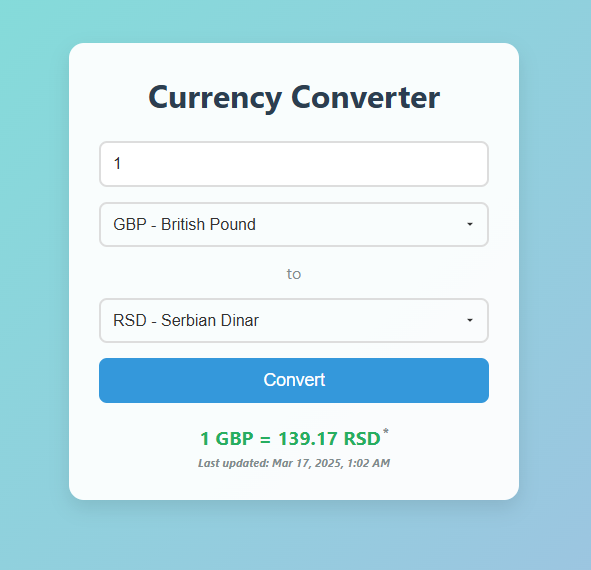

# Currency Converter

A simple, user-friendly web application that converts currencies using real-time exchange rates from the ExchangeRate-API.



## Features

- Convert between multiple currencies (USD, EUR, GBP, RSD, JPY, CAD, AUD, CHF)
- Real-time exchange rates
- Responsive design with modern UI
- Displays last update timestamp
- Loading animation during conversion
- Input validation and error handling

## Demo

https://laggiare.github.io/currency-converter/

## Technologies Used

- **HTML5**: Structure and content
- **CSS3**: Styling with custom animations and responsive design
- **JavaScript**: Dynamic functionality and API integration
- **ExchangeRate-API**: For real-time currency exchange rates

## Installation

1. Clone the repository:
```bash
git clone https://github.com/laggiare/currency-converter.git